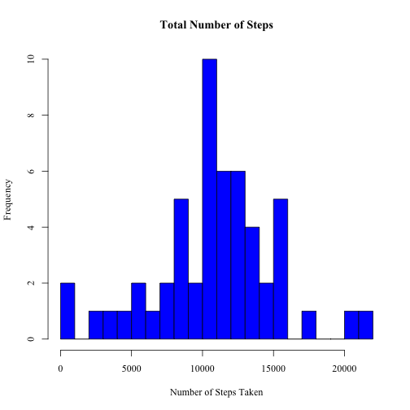
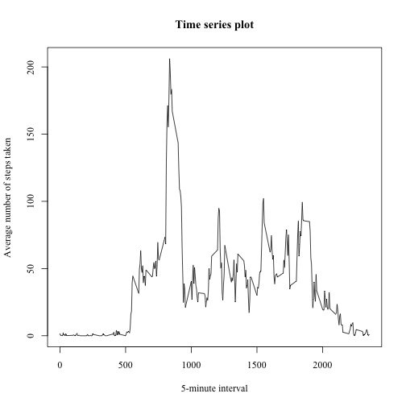
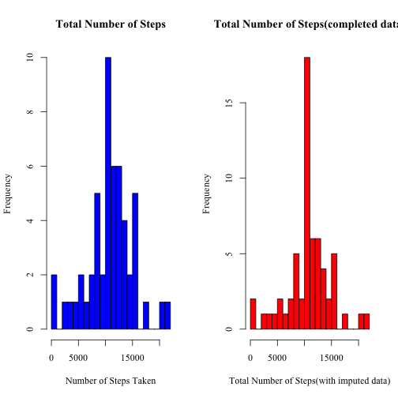
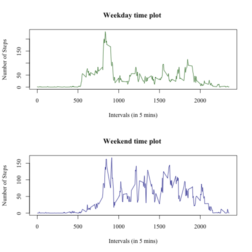

Introduction. 
============
This assignment makes use of data from a personal activity monitoring device. This device collects data at 5 minute intervals through out the day. The data consists of two months of data from an anonymous individual collected during the months of October and November, 2012 and include the number of steps taken in 5 minute intervals each day.

## Data

The data for this assignment can be downloaded from the course web site:

* Dataset: [Activity monitoring data](https://d396qusza40orc.cloudfront.net/repdata%2Fdata%2Factivity.zip).

The variables included in this dataset are:

* **steps**: Number of steps taking in a 5-minute interval (missing values are coded as NA)

* **date**: The date on which the measurement was taken in YYYY-MM-DD format

* **interval**: Identifier for the 5-minute interval in which measurement was taken

The dataset is stored in a comma-separated-value (CSV) file and there are a total of 17,568 observations in this dataset.

Analysis
========
**1. Loading and pre-processing the data**

The data must be in the user's working directory to work properly. The initial dataset was in a zip file which was unzipped with an external extractor before using this code.  

``` r
data<-read.csv("activity.csv")
head(data)
```

```
##   steps       date interval
## 1    NA 2012-10-01        0
## 2    NA 2012-10-01        5
## 3    NA 2012-10-01       10
## 4    NA 2012-10-01       15
## 5    NA 2012-10-01       20
## 6    NA 2012-10-01       25
```

``` r
tail(data)
```

```
##       steps       date interval
## 17563    NA 2012-11-30     2330
## 17564    NA 2012-11-30     2335
## 17565    NA 2012-11-30     2340
## 17566    NA 2012-11-30     2345
## 17567    NA 2012-11-30     2350
## 17568    NA 2012-11-30     2355
```

**2. What is mean total number of steps taken per day?**

We were told to ignore the missing values, i.e represented by "NA".
The missing values are removed below. 

``` r
activity<- data[!(is.na(data$steps)), ]
```

**Total Number of steps taken per day**

This was calculated using the aggregate function. 
A table showing the first 6 rows(using the head function) is also shown for clarification. 

``` r
TotalSteps<-aggregate(steps ~ date, activity, sum)
head(TotalSteps)
```

```
##         date steps
## 1 2012-10-02   126
## 2 2012-10-03 11352
## 3 2012-10-04 12116
## 4 2012-10-05 13294
## 5 2012-10-06 15420
## 6 2012-10-07 11015
```

**A histogram of the total number of steps taken per day**

``` r
hist(TotalSteps$steps, breaks=30, xlab="Number of Steps Taken", 
     main="Total Number of Steps",
     col = "blue", family = "Times new roman")
```



**The mean and median of the total number of steps taken per day.**  

The mean and median functions were used to calculate these values

``` r
MeanSteps<- mean(TotalSteps$steps)
MedianSteps<- median(TotalSteps$steps)
FirstValues<- c(mean=MeanSteps,median=MedianSteps)
print(FirstValues)
```

```
##     mean   median 
## 10766.19 10765.00
```
The calculated mean number of steps is **10766.18**, and the median is **10765**

**3. What is the average daily activity pattern?** 

We were asked to Make a time series plot of the 5-minute interval (x-axis) and the average number of steps taken, averaged across all days (y-axis). 

``` r
meanInterval<-aggregate(data$steps~ data$interval,data,mean)
colnames(meanInterval) <- c("interval", "steps")
head(meanInterval)
```

```
##   interval     steps
## 1        0 1.7169811
## 2        5 0.3396226
## 3       10 0.1320755
## 4       15 0.1509434
## 5       20 0.0754717
## 6       25 2.0943396
```
 The **ggplot2** package, specifically the **qplot** function is used to create the time series plot with the 5-minute interval on the x axis, and the average number of steps on the y axis.    
Note that geom = line for a line time series plot, otherwise the default is a scatterplot or histogram


``` r
library(ggplot2)
qplot(x=meanInterval$interval, y= meanInterval$steps, data = meanInterval, geom = "line", main ="Time series plot", xlab = "5-minute interval", ylab = "Average number of steps taken")
```

```
## Warning: Use of `meanInterval$interval` is discouraged.
## ℹ Use `interval` instead.
```

```
## Warning: Use of `meanInterval$steps` is discouraged.
## ℹ Use `steps` instead.
```


The qplot function is in the deprecated phase of its life cycle.  
Base R plotting can also be used as an alternative. 

``` r
plot(x=meanInterval$interval, y=meanInterval$steps, type="l",
     main="Time series plot",xlab="5-minute interval", ylab="Average number of steps taken", 
     col="black", family="times new roman")
```



The second part of the question asked "Which 5-minute interval, on average across all the days in the data set, contains the maximum number of steps?"  
The max function will be used here.
The grep function is used to search for the max pattern among the steps

``` r
meanInterval[grep(max(meanInterval$steps), meanInterval$steps),]
```

```
##     interval    steps
## 104      835 206.1698
```
The 5-minute interval that contained the max number of steps is **835**

**4. Imputing missing values. **

**The first task assigned is to calculate and report the total number of missing values in the data set (i.e. the total number of rows with NA)**

``` r
anyNA(data)
```

```
## [1] TRUE
```
with this function, the "data" data set is confirmed to have missing values.  

Next is the confirmation that the NA is confined to only one area of the dataset

``` r
sum(is.na(data$steps))
```

```
## [1] 2304
```

``` r
sum(is.na(data$date))
```

```
## [1] 0
```

``` r
sum(is.na(data$interval))
```

```
## [1] 0
```

``` r
data.frame(steps=sum(is.na(data$steps)),date=sum(is.na(data$date)),interval=sum(is.na(data$interval)))
```

```
##   steps date interval
## 1  2304    0        0
```
This confirms that all 2304 of the NA values are confined to only the "steps" column of the dataset

**The next task is devising a strategy for filling in all of the missing values in the dataset**
The NA values were replaced with the mean values for the interval.   
This was done using a for loop. 

The new dataset with the missing values imputed is named imputedData. 

``` r
imputedData <- data
for(x in 1:17568) {
    if(is.na(imputedData[x, 1])==TRUE) {
        imputedData[x, 1] <- meanInterval[meanInterval$interval %in% imputedData[x, 3], 2]
    }
}
head(imputedData)
```

```
##       steps       date interval
## 1 1.7169811 2012-10-01        0
## 2 0.3396226 2012-10-01        5
## 3 0.1320755 2012-10-01       10
## 4 0.1509434 2012-10-01       15
## 5 0.0754717 2012-10-01       20
## 6 2.0943396 2012-10-01       25
```

The third task involves making a histogram of the total number of steps taken each day with the completed dataset. 
The total number of steps is calculated again with the aggregate function. 

``` r
ImputedTotalSteps<-aggregate(steps ~ date, imputedData, sum)
head(ImputedTotalSteps)
```

```
##         date    steps
## 1 2012-10-01 10766.19
## 2 2012-10-02   126.00
## 3 2012-10-03 11352.00
## 4 2012-10-04 12116.00
## 5 2012-10-05 13294.00
## 6 2012-10-06 15420.00
```

The hist function(included in Rstudio) is used to plot the histogram of the total number of steps. 

``` r
hist(ImputedTotalSteps$steps, breaks=30, xlab="Total Number of Steps(with imputed data)", 
     main="Total Number of Steps(completed data)",
     col = "red", family = "Times new roman")
```


**The mean and median of the total number of steps taken per day for the completed data.**  

The values are calculated using the mean and median functions just like with the previous data

``` r
MeanImputedSteps<- mean(ImputedTotalSteps$steps)
MedianImputedSteps<- median(ImputedTotalSteps$steps)
ImputedValues<- c(meanvalue=MeanImputedSteps,medianvalue= MedianImputedSteps)
print(ImputedValues)
```

```
##   meanvalue medianvalue 
##    10766.19    10766.19
```

Next part of the task is comparing how the imputed values for the mean and median differ from the values in the previous data set.  
The rbind function is used to enter the values in a matrix for easy comparison

``` r
CompareValues<- rbind(FirstValues,ImputedValues)
print(CompareValues)
```

```
##                   mean   median
## FirstValues   10766.19 10765.00
## ImputedValues 10766.19 10766.19
```
The values of the two data sets are very similar, most likely due to the use of averages for the missing(NA) values. The mean values are the same, at **10766.19** steps, while the median value is larger for the imputed data set, at **10766.19** steps, rather than **10765** steps.

The histograms for both data sets can be compared too.  
The par function is used to set up a 1x2 layout, which plots the histograms side by side

``` r
par(mfrow=c(1, 2)) 
hist(TotalSteps$steps, breaks=30, xlab="Number of Steps Taken", 
     main="Total Number of Steps",
     col = "blue", family = "Times new roman")
hist(ImputedTotalSteps$steps, breaks=30, xlab="Total Number of Steps(with imputed data)", 
     main="Total Number of Steps(completed data)",
     col = "red", family = "Times new roman")
```



As shown in the histogram comparisons,the data with imputed values has a higher frequency of steps(due to the NA values being filled). 
Therefore, the impact of imputing missing data was an increase in the frequency of the total daily number of steps. 

**5. Are there differences in activity patterns between weekdays and weekends?**

The answer to the question would require the imputed data set.  
New factor variables will then be created, to distinguish between weekdays and weekends. 
i used the isWeekday function, a part of the timeDate package

``` r
library(timeDate)
daysData <- imputedData
daysData$weekdays <-factor(isWeekday(as.Date(as.character(daysData$date), format = "%Y-%m-%d"), wday = 1:5), labels = c("weekend", "weekday"))
```
The last task is making a panel plot containing a time series plot of the 5-minute interval(x-axis) and the average number of steps taken, averaged across all weekday days or weekend days (y-axis). 

To compare the weekday and weekend data, and create a panel plot of the average number of steps taken per interval, the data has to be split into two groups of weekday/weekend data, using the newly created variable.  

``` r
weekdayData<- daysData[daysData$weekdays=="weekday", ]
weekendData<- daysData[daysData$weekdays=="weekend", ]

weekendAverage<- aggregate(steps~ interval, weekendData, mean)
weekdayAverage<- aggregate(steps ~ interval, weekdayData, mean)
head(weekdayAverage)
```

```
##   interval      steps
## 1        0 2.25115304
## 2        5 0.44528302
## 3       10 0.17316562
## 4       15 0.19790356
## 5       20 0.09895178
## 6       25 1.59035639
```

``` r
head(weekendAverage)
```

```
##   interval       steps
## 1        0 0.214622642
## 2        5 0.042452830
## 3       10 0.016509434
## 4       15 0.018867925
## 5       20 0.009433962
## 6       25 3.511792453
```
 
 Then the two time plots for the weekend and weekday groups of data is to be plotted again using the par function to make a panel(2x1 layout) and the plot function for the time plot, setting type to "l"

``` r
par(mfrow=c(2, 1))
plot(weekdayAverage$interval, weekdayAverage$steps, type="l",
     main="Weekday time plot ",xlab="Intervals (in 5 mins)", ylab="Number of Steps", col="darkgreen", family="times new roman")
plot(weekendAverage$interval, weekendAverage$steps, type="l",
     main="Weekend time plot ",xlab="Intervals (in 5 mins)", ylab="Number of Steps", col="darkblue",family="times new roman")
```




